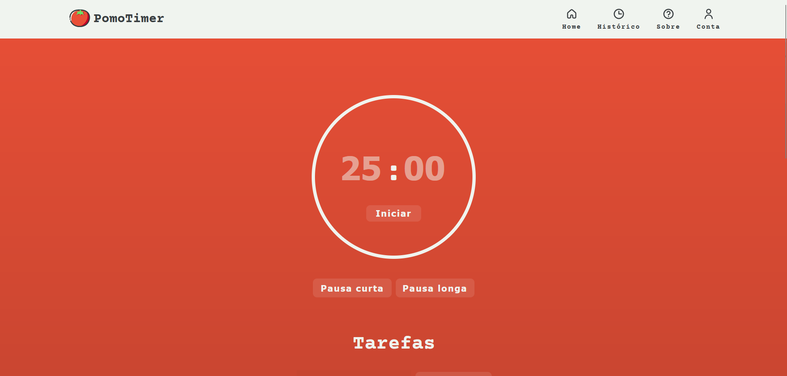
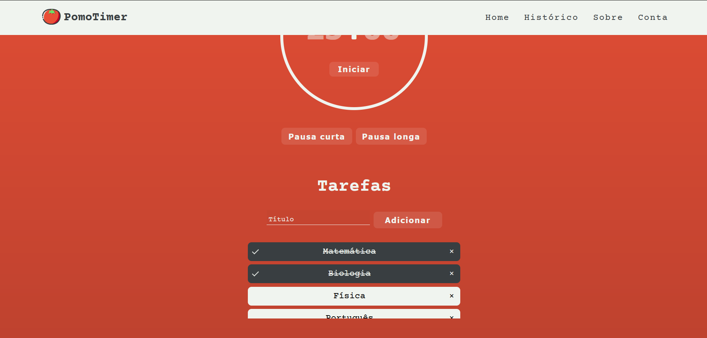

 
 <h1>PomoTimer</h1>

Site pomodoro para auxiliar na produtividade.

<h1>Showcase</h1>

 
 

<h1>To-do list</h1>

- [x] Estilizar o site
- [x] Criar a lógica do timer
- [x] Criar a aba "Sobre"
- [ ] Criar lógica e a aba do "Histórico"
- [ ] Criar a lógica para vincular contas
- [x] Publicar o projeto no GitHub Pages
