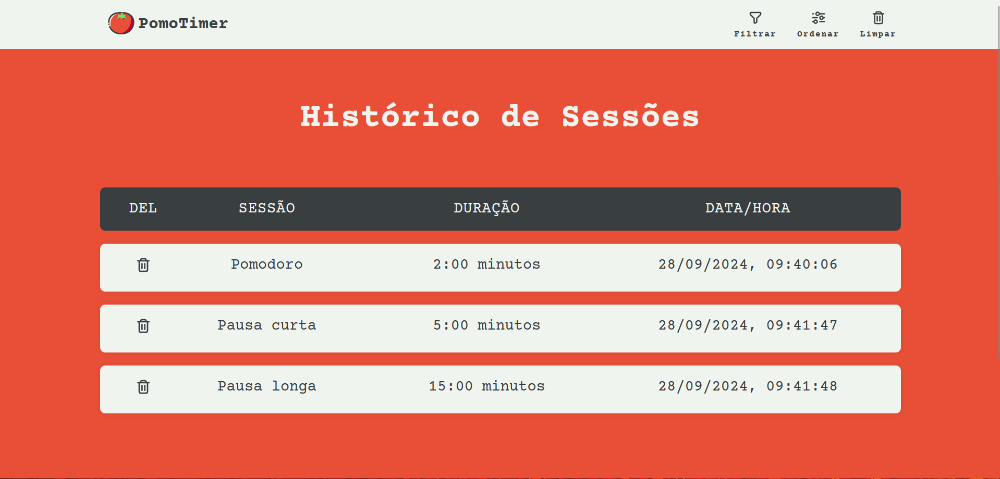

 
 <h1>PomoTimer</h1>

Site pomodoro para auxiliar na produtividade.

<h1>Preview</h1>

 
 
 

<h1>To-do list</h1>

- [x] Estilizar o site
- [x] Criar a lógica do timer
- [x] Criar a aba "Sobre"
- [x] Criar lógica e a aba do "Histórico"
- [x] Publicar o projeto no Vercel
- [ ] Criar a lógica para vincular contas
- [ ] Criar o sistema de leaderboard
- [ ] Gerar gráficos de desempenho semanal, mensal e anual
